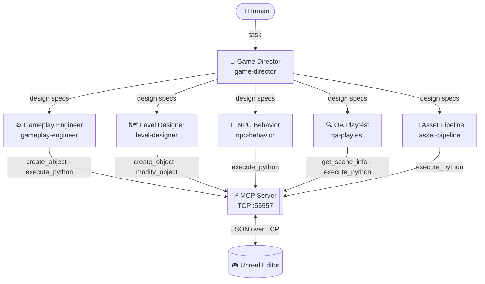
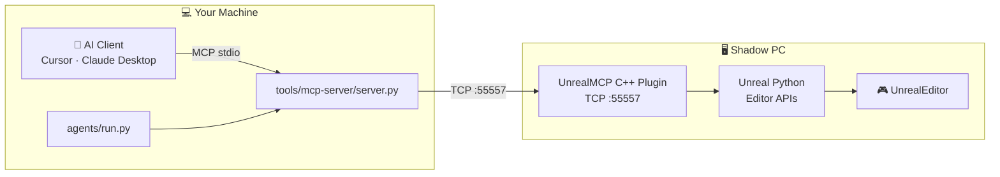

<div align="center">

# 🎮 game-starter

**Production-grade Unreal Engine 5.7 game template**  
Built on Lyra · driven by a 6-agent AI dev workflow · controlled via MCP

[](https://python.org)
[](https://unrealengine.com)
[](https://docs.astral.sh/uv/)
[](https://modelcontextprotocol.io)
[](https://github.com/ahnafyy/game-starter/actions/workflows/agent-tests.yml)

</div>

Lyra provides the gameplay framework — abilities, input, UI, multiplayer patterns, modular game modes. The agents handle development automation. **Replace the game concept with your own.**

## 📦 What's in this repo

| Layer | What | Where |
|---|---|---|
| 🎮 UE project stub | `.uproject`, `Config/`, `Source/` | `Game/` |
| 🔌 Unreal MCP plugin | chongdashu/unreal-mcp (git submodule) | `Game/Plugins/UnrealMCP/` |
| 🤖 Python agent layer | 6 dev agents + shared MCP client | `agents/` |
| 🛠️ Dev tools | Build, test, package scripts | `tools/` |
| ⚙️ CI | GitHub Actions (Python lint/test + UE automation) | `.github/workflows/` |

> **⚠️ Lyra content and plugins are NOT in this repo** (Epic EULA prohibits redistribution). `Game/Content/`, `Game/Plugins/CommonGame/`, and `Game/Plugins/GameplayMessageRouter/` are gitignored. You install Lyra Starter Game via the Epic Games Launcher and copy them in locally. See [docs/setup.md](docs/setup.md) step 6 for the exact commands.

## 🤖 Six-agent dev workflow



## 🏗️ Architecture



## ⚡ Prerequisites

| | Requirement | Version | Notes |
|---|---|---|---|
| 🎮 | Unreal Engine | 5.7 | Via Epic Games Launcher — [docs/setup.md](docs/setup.md) |
| �️ | Visual Studio | 2022 | "Game development with C++" workload required to compile C++ modules |
| �🐍 | Python | 3.12+ | |
| 📦 | uv | latest | `pip install uv` |
| 🔀 | Git | 2.x | With submodule support |
| 🖥️ | Shadow PC or capable machine | — | UE 5.7 is too heavy for MacBook Air |

## 🚀 Quick start

```powershell
# 1. Clone
git clone git@github.com:ahnafyy/game-starter.git
cd game-starter

# 2. Bootstrap (submodules + Python venv + mcp.json)
bash scripts/setup.sh

# 3. Copy Lyra content + plugins (requires Lyra Starter Game installed via Epic Games Launcher)
$lyra = "C:\UnrealProjects\LyraStarterGame"
xcopy "$lyra\Content"                       "Game\Content"                       /E /I /Y
xcopy "$lyra\Plugins\CommonGame"            "Game\Plugins\CommonGame"            /E /I /Y
xcopy "$lyra\Plugins\CommonUser"            "Game\Plugins\CommonUser"            /E /I /Y
xcopy "$lyra\Plugins\GameplayMessageRouter" "Game\Plugins\GameplayMessageRouter" /E /I /Y
xcopy "$lyra\Plugins\ModularGameplayActors" "Game\Plugins\ModularGameplayActors" /E /I /Y

# 4. Build (requires Visual Studio 2022 with "Game development with C++" workload)
& "C:\Program Files\Epic Games\UE_5.7\Engine\Build\BatchFiles\Build.bat" GameStarterEditor Win64 Development "$PWD\Game\GameStarter.uproject" -waitmutex

# 5. Open the UE project
#    Double-click Game/GameStarter.uproject
```

After the UE project builds, enable the **UnrealMCP** plugin:
`Edit → Plugins → search "UnrealMCP" → Enable → Restart Editor`

## 🎮 Running an agent

### Option A — VS Code Copilot (recommended)

Open Copilot Chat, click the agent picker, and choose one of the six built-in agents:

| Agent | What it does |
|---|---|
| **Game Director** | GDD, feature backlog, scope decisions |
| **Gameplay Engineer** | C++ / Blueprint coding via MCP tools |
| **Level Designer** | Actor placement, lighting, navmesh via MCP tools |
| **NPC Behavior** | StateTree / AI scaffolding via MCP tools |
| **QA Playtest** | Automated tests and bug reports via MCP tools |
| **Asset Pipeline** | Naming audits and bulk renames via MCP tools |

VS Code auto-starts the MCP server — no terminal needed. Unreal Editor must be open with the UnrealMCP plugin enabled for the engineering agents to issue editor commands.

### Option B — Python CLI

Requires a `.env` file with `GITHUB_TOKEN` or `LLM_API_KEY` (see [docs/setup.md](docs/setup.md)).

```bash
# Start the MCP server (Unreal Editor must be open and MCP plugin running)
uv run tools/mcp-server/server.py

# In another terminal, run any agent
uv run python -m agents.run --agent game-director   --task "describe the core gameplay loop"
uv run python -m agents.run --agent level-designer  --task "place a spawn point in the starting area"
uv run python -m agents.run --agent qa-playtest     --task "verify the player spawns correctly"
```

Available agents: `game-director` · `gameplay-engineer` · `level-designer` · `npc-behavior` · `qa-playtest` · `asset-pipeline`

See [docs/agents.md](docs/agents.md) for the full reference.

## 🗂️ Repo structure

```
game-starter/
├── Game/
│   ├── GameStarter.uproject        UE 5.7 project descriptor
│   ├── Config/                     DefaultEngine.ini (version-pinned), DefaultGame.ini, DefaultEditor.ini
│   ├── Source/GameStarter/         C++ module shell (Build.cs, .h, .cpp)
│   └── Plugins/UnrealMCP/          ← git submodule: chongdashu/unreal-mcp
│
├── agents/
│   ├── shared/                     mcp_client.py, base_agent.py, contracts.py
│   ├── roles/                      6 agent roles (game_director, gameplay_engineer, ...)
│   │   └── <role>/
│   │       ├── agent.py            extend BaseAgent, implement run()
│   │       ├── config.yaml         role, model, allowed_tools, escalation
│   │       └── prompts/system.md   LLM system prompt
│   └── run.py                      CLI entry point
│
├── tools/
│   ├── mcp-server/server.py        Launches the UnrealMCP Python server
│   ├── ue-command-scripts/         build.sh, run-automation-tests.sh, package.sh
│   └── validation-scripts/         validate_assets.py
│
├── tests/                          pytest suite (29 tests)
├── scripts/setup.sh                one-command bootstrap
├── mcp.json.template               MCP client config template (filled in by setup.sh)
├── .github/workflows/
│   ├── agent-tests.yml             ruff + pytest on push/PR
│   └── ue-automation.yml           UE headless automation tests (self-hosted runner)
└── pyproject.toml
```

## 🔧 Development setup

Full step-by-step for Shadow PC (recommended) and native Mac: [docs/setup.md](docs/setup.md)

## 🍎 Playing on your Mac after MVP

Once development is done on Shadow PC, you package the game and run the `.app` on your Mac — no UE install required. See [docs/playing-on-mac.md](docs/playing-on-mac.md).

## ✅ CI

| Workflow | Trigger | What it does |
|---|---|---|
| `agent-tests.yml` | push / PR touching `agents/` or `tests/` | ruff lint + pytest |
| `ue-automation.yml` | push / PR touching `Game/` | build + UE Automation Tests (self-hosted macOS runner) |
